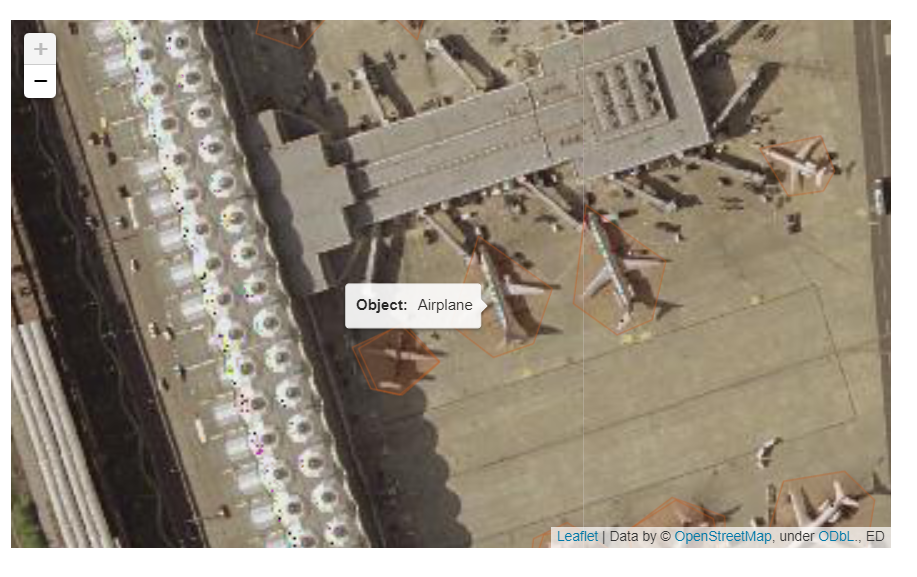

# Web Map Streamlit App

## Summary
An application that ultilizes ellipsis and folium to display a raster satellite image and a vector object dectection data in a web app in streamlit using leaftlet and open street maps.

Deployed and ready to be tested on :

## Example

## Made Possible with Adapatation from:
#### Implementation -> https://medium.com/@daniel_819/a-web-map-in-10-lines-of-code-with-streamlit-ellipsis-and-folium-6e41f7407d68

